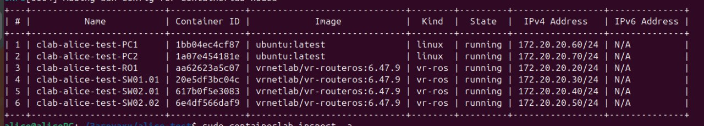
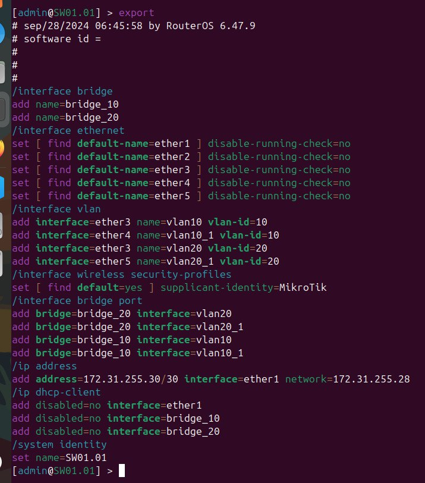
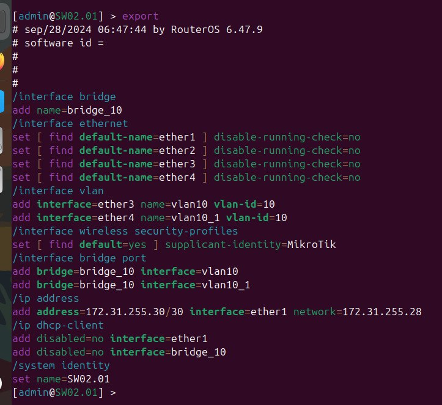
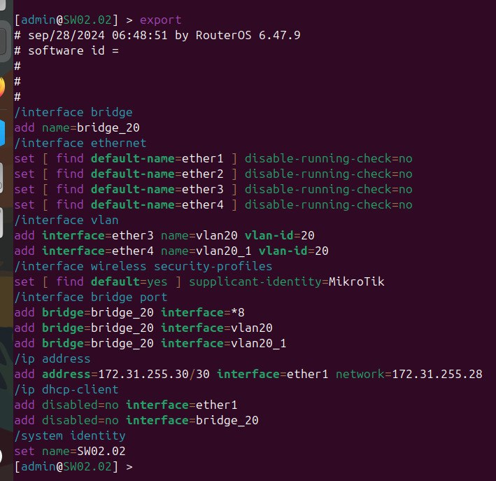
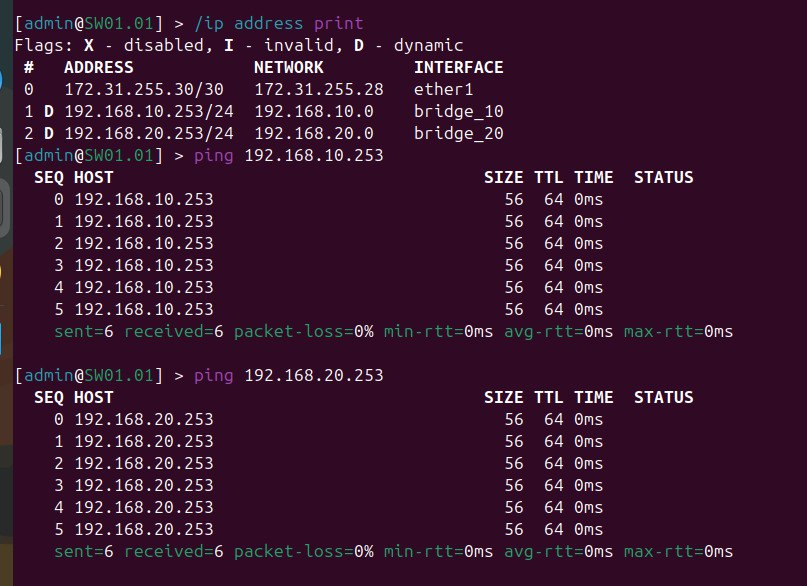
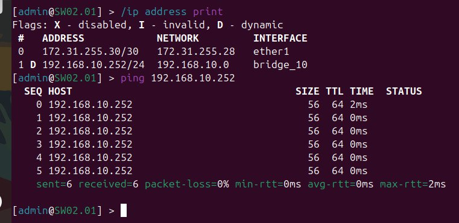
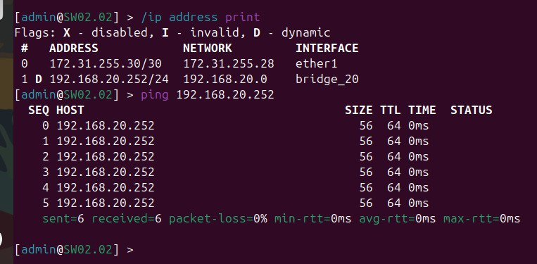

University: [ITMO University](https://itmo.ru/ru/)

Faculty: [FICT](https://fict.itmo.ru)

Course: [Introduction in routing](https://github.com/itmo-ict-faculty/introduction-in-routing)

Year: 2024/2025

Group: K3320

Author: Kolomiets Alice Denisovna

Lab: Lab1

Date of create: 21.09.2024

Date of finished: 28.09.2024

# Отчёт по лабораторной работе №1 "Установка ContainerLab и развертывание тестовой сети связи"

***Цель:*** ознакомиться с инструментом ContainerLab и методами работы с ним, изучить работу VLAN, IP адресации и т.д.

## Ход работы

Сначала была попытка сделать лабораторную работу в виртуальной машине (Ubuntu) но после сложностей с развертыванием контейнером и подключения к устройствам было принято решение установит Linux второй ОС. После этого все было реализовано успешно 

В yaml-файле была задана топология сети, указанная на схеме

## Конфигурация

### После задания конфигураций нод, проверим работоспособность:

