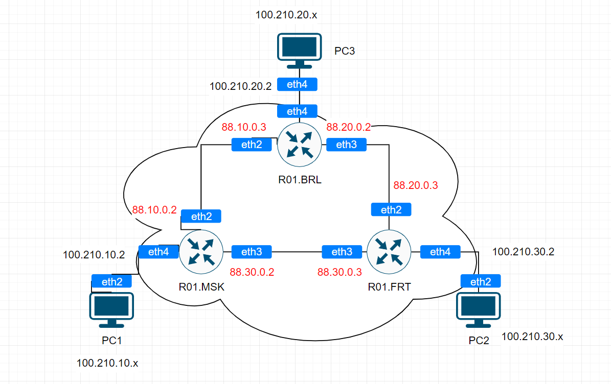

University: [ITMO University](https://itmo.ru/ru/)

Faculty: [FICT](https://fict.itmo.ru)

Course: [Introduction in routing](https://github.com/itmo-ict-faculty/introduction-in-routing)

Year: 2024/2025

Group: K3320

Author: Kolomiets Alice Denisovna

Lab: Lab2

Date of create: 08.10.2024

Date of finished: 09.10.2024

# Отчёт по лабораторной работе №2 "Эмуляция распределенной корпоративной сети связи, настройка статической маршрутизации между филиалами"

***Цель:*** Ознакомиться с принципами планирования IP адресов, настройке статической маршрутизации и сетевыми функциями устройств.

## Ход работы

Схема работы: 

## Таблицы маршрутизации:
#### R01.MSK

#### R02.BRL

#### R03.FRT

## Результаты пингов 

