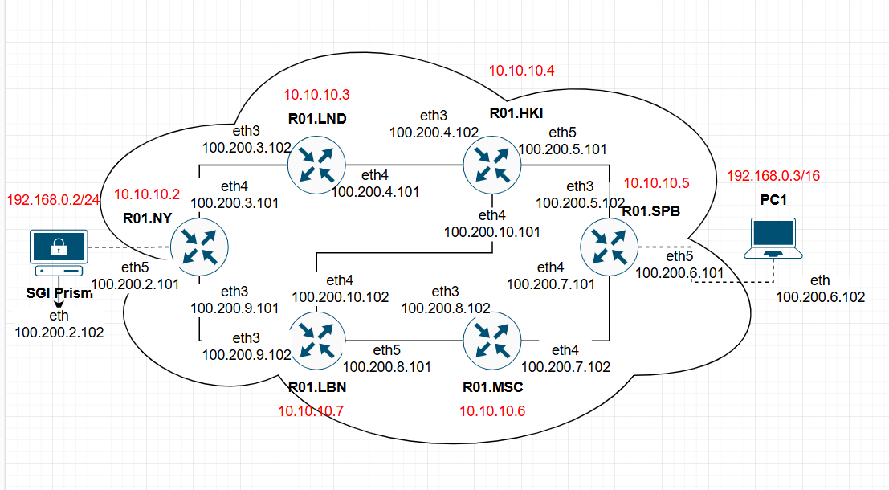
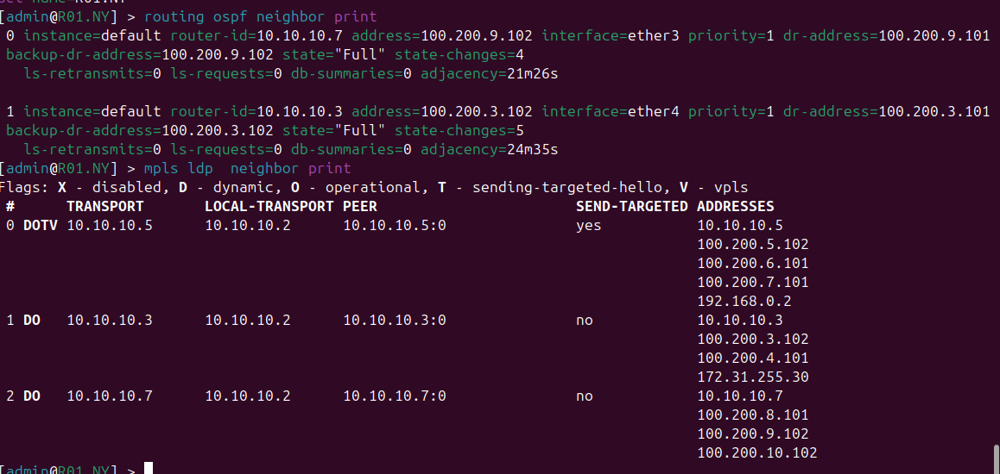
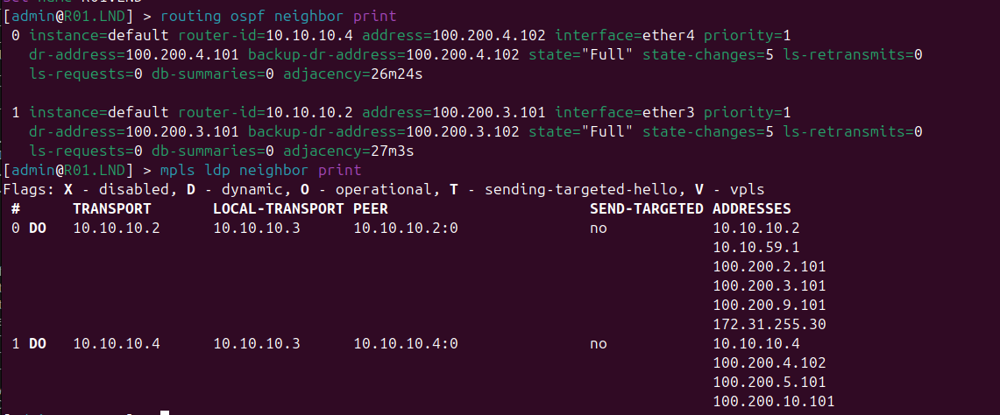
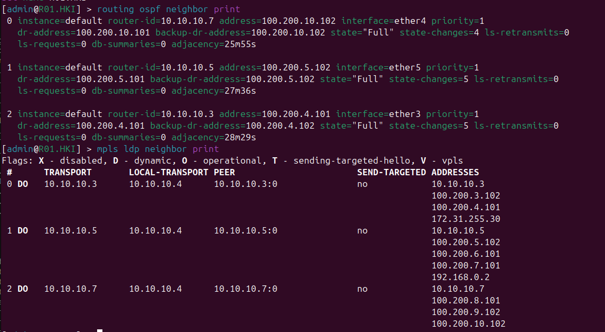
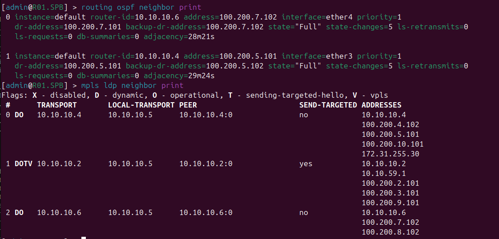
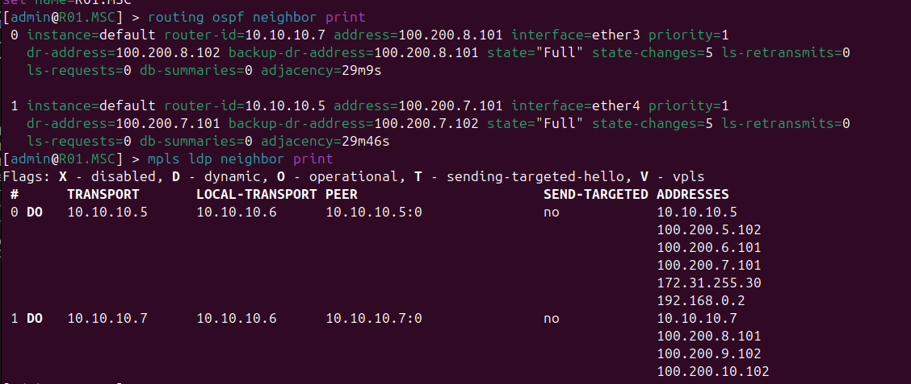
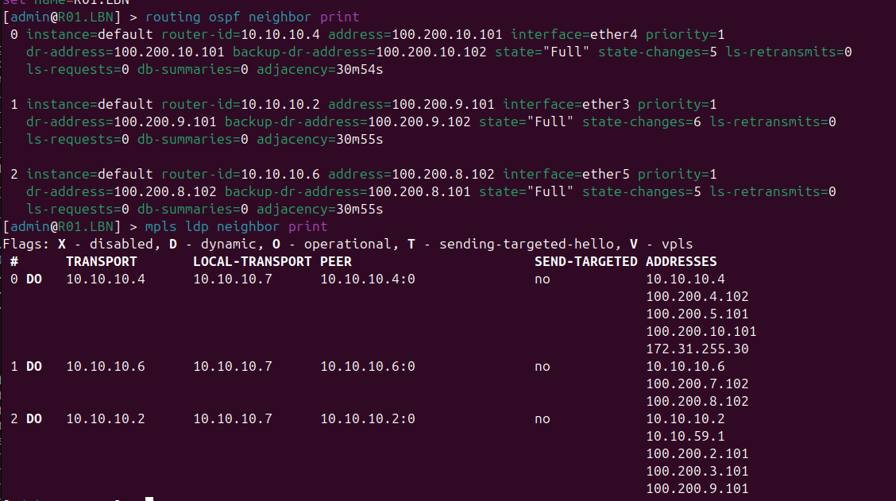
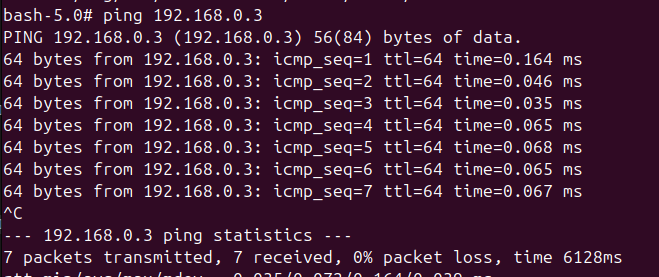
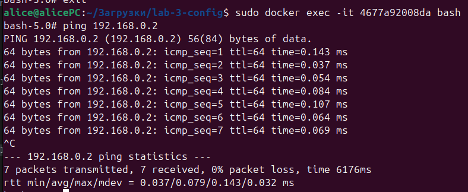

University: [ITMO University](https://itmo.ru/ru/)

Faculty: [FICT](https://fict.itmo.ru)

Course: [Introduction in routing](https://github.com/itmo-ict-faculty/introduction-in-routing)

Year: 2024/2025

Group: K3320

Author: Kolomiets Alice Denisovna

Lab: Lab3

Date of create: 04.11.2024

Date of finished: 05.11.2024

# Отчёт по лабораторной работе №3 "Эмуляция распределенной корпоративной сети связи, настройка OSPF и MPLS, организация первого EoMPLS"

***Цель:*** Изучить протоколы OSPF и MPLS, механизмы организации EoMPLS.

## Ход работы

### Схема работы: 

### RO1.NY:

### RO1.LND:

### RO1.HKI:

### RO1.SPB:

### RO1.MSC:

### RO1.LBN:

## Результаты пингов (PC1 -> SGI_PRISM, SGI_PRISM -> PC1)

##  Трассировка между роутерами (SPB и NY) - можно увидеть что используются разные маршруты 

