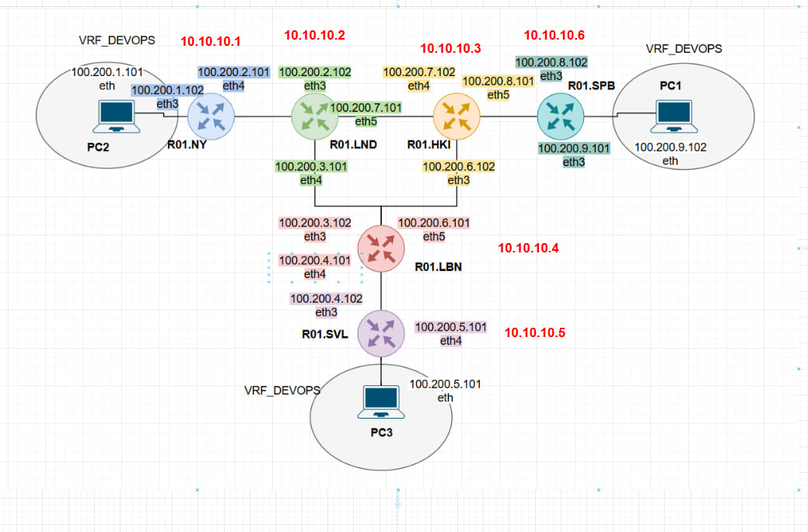

University: [ITMO University](https://itmo.ru/ru/)

Faculty: [FICT](https://fict.itmo.ru)

Course: [Introduction in routing](https://github.com/itmo-ict-faculty/introduction-in-routing)

Year: 2024/2025

Group: K3320

Author: Kolomiets Alice Denisovna

Lab: Lab4

Date of create: 10.12.2024

Date of finished: 15.12.2024

# Отчёт по лабораторной работе №3 "Эмуляция распределенной корпоративной сети связи, настройка iBGP, организация L3VPN, VPLS"

## Ход работы

### Схема работы: 

## Часть 1
### PING: R01.NY -> R01.SPB, R01.SVL:

### PING: R01.SPB -> R01.NY, R01.SVL:

### PING: R01.SVL -> R01.SPB, R01.NY:

## Часть 2
### PING: PC1 -> PC2, PC3:

### PING: PC2 -> PC1, PC3:

### PING: PC3 -> PC1, PC2:

